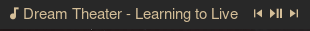
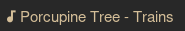

# What is polybar-musicjs
polybar-musicjs are scripts written in Javascript that outputs the current 
song that is playing on your Spotify (Gives you prev,playpause and next
controls) or LastFM scrobbler.

These scripts can be used with polybar to make your own module.

# What does it look like?

## Spotify


## LastFM


# Dependencies
  - Make sure you have [Node.js](https://nodejs.org/en/) installed 
    - Atleast verision 14.15.4, which is the LTS
  - [dbus-next](https://github.com/dbusjs/node-dbus-next)
  - [dotenv](https://github.com/motdotla/dotenv)
  - [axios](https://github.com/axios/axios)

# How to Use
  - Clone the repo wherever you'd like (I'd recommend somewhere in your 
  polybar config directory)
  ```
  cd $HOME/.config/polybar
  git clone https://github.com/lyonelz96/polybar-musicjs.git
  ```
  - Do an npm install in the polybar-musicjs directory
  ```
  cd polybar-musicjs
  npm install
  ```
  - If you're going to use the LastFM module
    - Make sure you have an [API Key](https://www.last.fm/api)
      - Don't make this public
    - Make sure to create a '.env' file in the polybar-musicjs directory
    - Add your LASTFM_API_KEY and LASTFM_USERNAME environment variables to it
    - .env should look something like this
    ```
    LASTFM_API_KEY="12345678910"
    LASTFM_USERNAME="user"
    ```
    - Don't make the contents of this file public!
  - At this point you can test the scripts out by running
  ```
  node path/to/script.js
  ```
## Polybar Modules
  - I provided a sane starting point for the respective modules on the
  polybar-modules directory in the repo
  - You can either copy paste that into your polybar config or you can copy
  the .ini files into your polybar config directory and include them in your
  polybar config
  ```
  cd polybar-musicjs/polybar-modules
  cp spotify.ini lastfm.ini $HOME/.config/polybar
  ```
  - Then you can include them in your polybar config like this
  ```
  include-files = path/to/spotify.ini
  include-files = path/to/lastfm.ini
  ```
  - The following modules are provided
    - Spotify
      - spotify (Shows the song)
      - prev (Click to go to previous song)
      - playpause (Click to play/pause song)
      - next (Click to go to next song)
    - LastFM
      - lastfm (Shows the song)
  - Make sure you edit the spotify.ini and lastfm.ini files for your needs and
  fill out the execution paths!
    - For example, the spotify module might look like this
    ```
    [module/spotify]
    type = custom/script
    exec = "node path/to/spotify_metadata.js"
    exec-if = pgrep -x spotify
    tail = true

    format =  <label>
    format-padding = 1
    ```
    - The prev module might look like this
    ```
    [module/prev]
    type = custom/script
    exec = echo "prev"
    exec-if = pgrep -x spotify
    tail = true

    format = 玲
    format-padding = 1

    click-left = "node path/to/prev.js"
    ```
  - Add the modules to your bar in the polybar config
  - Launch polybar! Hopefully everything is working :)

# Issues/Pull Requests
  - Feel free to open an issue if you found a bug, as well as making a PR
  - I provided some simple templates so they can give you an idea of how 
  to make the best issue or PR you can! If you have better ideas for templates
  let me know too!
